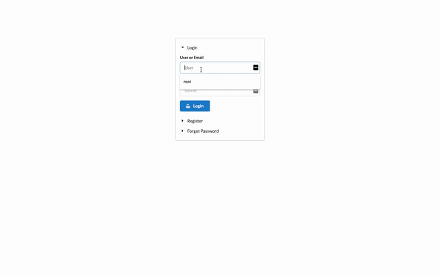

> Alpha version 0.0.0.1 (under active development)

This is a demonstration of how to implement user authentication directly in a shiny app. The core idea is to provide a simple, secure and modularized solution.  

Features:

1. User's credentials are saved as JSON file in `data/users`
2. easy to integrate with `shiny.info` in order to log user actions
3. R6 class user management 
4. admin panel to edit user data
5. tested with shinyapps.io


Minimal example of `shinyuser`

```{r, eval = F}
pacman::p_load(devtools, shiny, shiny.semantic, semantic.dashboard, tidyverse,
                RSQLite, shinyjs, R6)

ui <- dashboardPage(
  dashboardHeader(
    inverted = T,
    manager_ui("manager")
  ),
  dashboardSidebar(
    side = "left", size = "", inverted = T,
    sidebarMenu(
      div(class = "item",
          h4(class = "ui inverted header", "Something")
      )
    )
  ),
  dashboardBody(
    div(class = "sixteen wide column",
      "Something great"
    )
  )
)

server <- function(input, output) {
  
  ### User authentification
  user <- callModule(login_server, "user")
  ### User managment
  callModule(manager_server, "manager", user)
  ### Authorized content
  output$authorized <- renderUI({ if(user()$status == 1) ui })
  # observe({ glimpse(user()) })

  ### Your Code
}

shinyApp(meta_ui(), server)
```

The app will start up with a login/sign in modal.

  <!-- width = "80%" -->